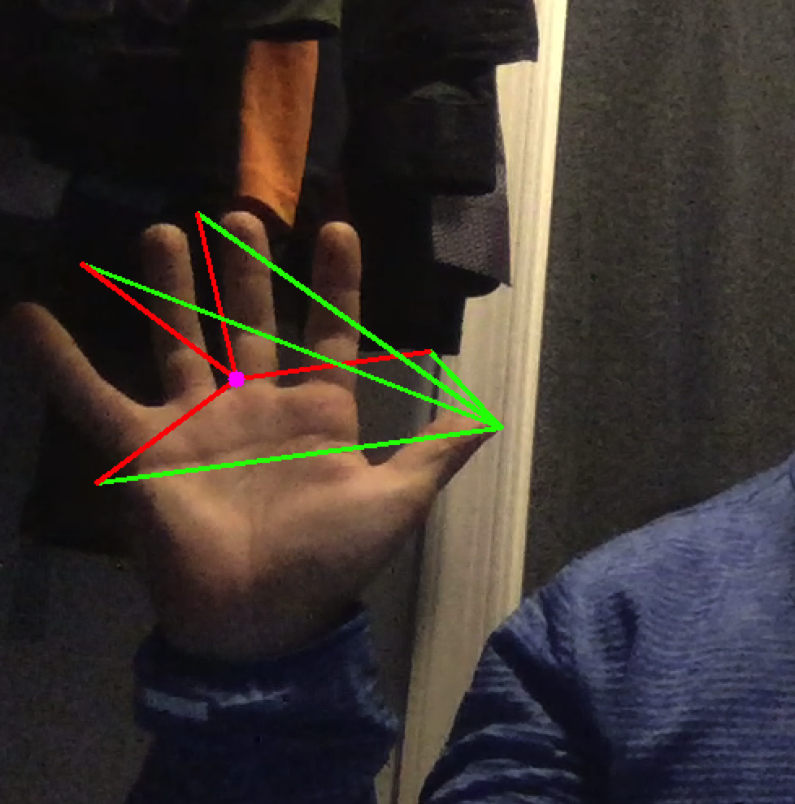

# Getting a HANDle on Machine Learning with Thanksgiving Hand-Turkey Filters #
## Created by Victor Arsenescu, Fall 2020 ##

:turkey: :turkey: :turkey: :turkey: :turkey: :turkey: :turkey: :turkey: :turkey:

**Tufts IEEE** welcomes you to our second *Night in The Lab*, where you will learn:

- [x] What Machine Learning even is and why it's awesome.
- [x] How images are internally represented by your computer.
- [x] Basic Python and cool libraries - **no prior coding experience necessary !!!**
- [x] How to manipulate images and extract meaningful features from a live video stream.

[Slides](https://docs.google.com/presentation/d/1kx23GVJjyNQdk4LjLtKPY-HkIK3Q-LQ6n0yqy-olBHE/edit#slide=id.ga76b4c6ef0_0_20)

@v0rtex20k
[Victor's personal site](https://www.eecs.tufts.edu/~varsen01/)

### Here's what it looks like out of the box: ###

### Here's what it looks like under the hood: ###

